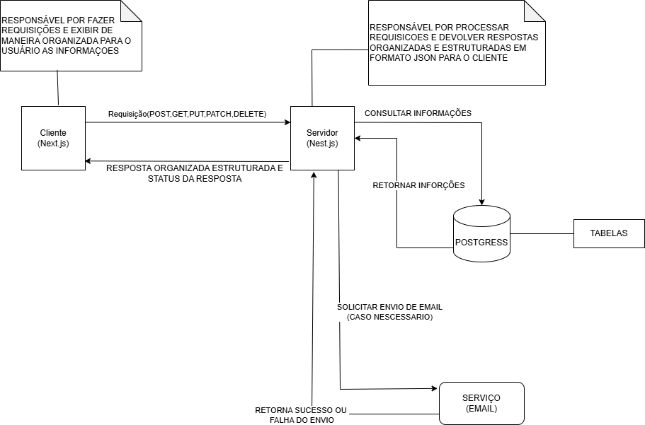

# Gestão para Grupos de Networking
Plataforma de gestão para grupos de networking, focada em digitalizar e otimizar o controle de membros e suas interações. Substitui planilhas e registros manuais por um sistema centralizado, eficiente e escalável, permitindo maior organização e acompanhamento das atividades do grupo.

## Diagrama da arquitetura(Cliente - Servidor):


## Modelo de dados

### Justificativa da escolha do banco de dados

A escolha do PostgreSQL foi feita por ser um banco de dados relacional, robusto e confiável, com excelente suporte a consultas complexas, integridade de dados e transações seguras. Ele é altamente escalável, flexível e compatível com diversos ORMs, o que facilita o desenvolvimento e manutenção da aplicação. Além disso, possui uma grande comunidade e documentação sólida, garantindo suporte e evolução constante.

### Modelagem (diagrama)

Abaixo está a representação da modelagem de dados proposta.


### Tabelas:

As tabelas abaixo descrevem a modelagem inicial do banco de dados. Os tipos seguem as regras do PostgreSQL.

#### Tabela: users

| Campo         | Tipo                                | Descrição |
|---------------|-------------------------------------|-----------|
| id            | SERIAL PRIMARY KEY                  | ID único do usuário |
| full_name     | VARCHAR(255) NOT NULL               | Nome completo |
| email         | VARCHAR(255) NOT NULL UNIQUE        | E-mail único |
| password_hash | VARCHAR(255) NOT NULL               | Senha criptografada |
| is_admin      | BOOLEAN DEFAULT FALSE               | Se é administrador |
| is_member     | BOOLEAN DEFAULT FALSE               | Se é membro aprovado |
| created_at    | TIMESTAMP DEFAULT NOW()             | Data de criação |

Observações:

- Tabela principal de usuários
- Um usuário pode ser admin, membro ou ambos
- Email deve ser único no sistema

#### Tabela: membership_intentions

| Campo         | Tipo                                | Descrição |
|---------------|-------------------------------------|-----------|
| id            | SERIAL PRIMARY KEY                  | ID único da intenção |
| full_name     | VARCHAR(255) NOT NULL               | Nome completo |
| email         | VARCHAR(255) NOT NULL               | E-mail |
| phone         | VARCHAR(50)                         | Telefone |
| company       | VARCHAR(255)                        | Empresa |
| position      | VARCHAR(255)                        | Cargo |
| group_id      | INTEGER REFERENCES groups(id)       | ID do grupo |
| status        | VARCHAR(20) DEFAULT 'pending'       | pending, approved, rejected |
| token         | VARCHAR(255)                        | Token para cadastro |
| created_at    | TIMESTAMP DEFAULT NOW()             | Data de criação |

Observações:

- Formulário público de interesse
- Admin aprova/rejeita
- Token usado para criar conta após aprovação

#### Tabela: groups

| Campo         | Tipo                                | Descrição |
|---------------|-------------------------------------|-----------|
| id            | SERIAL PRIMARY KEY                  | ID único do grupo |
| name          | VARCHAR(255) NOT NULL               | Nome do grupo |
| description   | TEXT                                | Descrição |
| admin_id      | INTEGER REFERENCES users(id)        | ID do admin |
| created_at    | TIMESTAMP DEFAULT NOW()             | Data de criação |

Observações:

- Grupos criados por administradores
- Cada grupo tem um admin responsável

#### Tabela: member_profiles

| Campo           | Tipo                                | Descrição |
|-----------------|-------------------------------------|-----------|
| id              | SERIAL PRIMARY KEY                  | ID único do perfil |
| user_id         | INTEGER REFERENCES users(id)        | ID do usuário |
| bio             | TEXT                                | Biografia/Descrição |
| professional_area| VARCHAR(255)                       | Área de atuação |
| interests       | TEXT[]                             | Áreas de interesse |
| linkedin_url    | VARCHAR(255)                        | URL do LinkedIn |
| website         | VARCHAR(255)                        | Site pessoal/profissional |
| skills          | TEXT[]                             | Habilidades principais |
| goals           | TEXT                                | Objetivos no grupo |
| business_size   | VARCHAR(50)                        | Tamanho do negócio |
| target_audience | TEXT                                | Público-alvo |
| created_at      | TIMESTAMP DEFAULT NOW()             | Data de criação |
| updated_at      | TIMESTAMP DEFAULT NOW()             | Última atualização |

#### Tabela: group_members

| Campo         | Tipo                                | Descrição |
|---------------|-------------------------------------|-----------|
| id            | SERIAL PRIMARY KEY                  | ID único |
| user_id       | INTEGER REFERENCES users(id)        | ID do usuário |
| group_id      | INTEGER REFERENCES groups(id)       | ID do grupo |
| joined_at     | TIMESTAMP DEFAULT NOW()             | Data de entrada |

Observações:

- Relaciona usuários com grupos
- Um usuário pode estar em vários grupos

#### Tabela: announcements

| Campo         | Tipo                                | Descrição |
|---------------|-------------------------------------|-----------|
| id            | SERIAL PRIMARY KEY                  | ID único |
| title         | VARCHAR(255) NOT NULL               | Título |
| content       | TEXT NOT NULL                       | Conteúdo |
| author_id     | INTEGER REFERENCES users(id)        | ID do autor |
| group_id      | INTEGER REFERENCES groups(id)       | ID do grupo |
| created_at    | TIMESTAMP DEFAULT NOW()             | Data de criação |

Observações:

- Sistema de avisos
- Podem ser para um grupo específico ou gerais

#### Tabela: meetings

| Campo         | Tipo                                | Descrição |
|---------------|-------------------------------------|-----------|
| id            | SERIAL PRIMARY KEY                  | ID único |
| title         | VARCHAR(255) NOT NULL               | Título |
| group_id      | INTEGER REFERENCES groups(id)       | ID do grupo |
| date_time     | TIMESTAMP NOT NULL                  | Data e hora |
| location      | VARCHAR(255)                        | Local |
| created_at    | TIMESTAMP DEFAULT NOW()             | Data de criação |

Observações:

- Agenda de reuniões
- Cada reunião pertence a um grupo

#### Tabela: meeting_attendances

| Campo         | Tipo                                | Descrição |
|---------------|-------------------------------------|-----------|
| id            | SERIAL PRIMARY KEY                  | ID único |
| user_id       | INTEGER REFERENCES users(id)        | ID do usuário |
| meeting_id    | INTEGER REFERENCES meetings(id)     | ID da reunião |
| attended      | BOOLEAN DEFAULT FALSE               | Se compareceu |
| created_at    | TIMESTAMP DEFAULT NOW()             | Data do registro |

Observações:

- Controle de presença
- Um usuário só pode ter um registro por reunião

#### Tabela: business_referrals

| Campo         | Tipo                                | Descrição |
|---------------|-------------------------------------|-----------|
| id            | SERIAL PRIMARY KEY                  | ID único |
| from_user_id  | INTEGER REFERENCES users(id)        | Quem indicou |
| to_user_id    | INTEGER REFERENCES users(id)        | Quem recebeu |
| description   | TEXT NOT NULL                       | Descrição |
| status        | VARCHAR(20) DEFAULT 'pending'       | Status da indicação |
| created_at    | TIMESTAMP DEFAULT NOW()             | Data da indicação |

Observações:

- Sistema de indicações
- Rastreia indicações entre membros

#### Tabela: thanks

| Campo         | Tipo                                | Descrição |
|---------------|-------------------------------------|-----------|
| id            | SERIAL PRIMARY KEY                  | ID único |
| from_user_id  | INTEGER REFERENCES users(id)        | Quem agradece |
| to_user_id    | INTEGER REFERENCES users(id)        | Quem recebe agradecimento |
| message       | TEXT NOT NULL                       | Mensagem |
| created_at    | TIMESTAMP DEFAULT NOW()             | Data |

Observações:

- Agradecimentos por negócios
- Reconhecimento entre membros

#### Tabela: membership_payments

| Campo         | Tipo                                | Descrição |
|---------------|-------------------------------------|-----------|
| id            | SERIAL PRIMARY KEY                  | ID único |
| user_id       | INTEGER REFERENCES users(id)        | ID do usuário |
| amount        | DECIMAL(10,2) NOT NULL              | Valor |
| due_date      | DATE NOT NULL                       | Data de vencimento |
| paid_date     | DATE                                | Data do pagamento |
| status        | VARCHAR(20) DEFAULT 'pending'       | Status |
| created_at    | TIMESTAMP DEFAULT NOW()             | Data de criação |

Observações:

- Controle de mensalidades
- Status: pending, paid, overdue
  
## Estrutura de Componentes (Frontend)

O frontend será desenvolvido em Next.js, aproveitando seu roteamento nativo, renderização híbrida (SSR, SSG e ISR) e recursos modernos como layouts aninhados e Server Components. Isso garante melhor SEO, carregamento rápido e uma experiência de usuário fluida e responsiva.

Adotaremos o padrão de componentização Atomic Design (átomos, moléculas, organismos, templates e páginas) para promover alta reutilização, consistência visual e facilidade de manutenção.

- Átomos: elementos atômicos e sem estado — botões, ícones, inputs, labels, badges. Devem ser puros, pequenos e reusáveis.
- Moléculas: combinações simples de átomos que formam blocos funcionais — um campo de pesquisa com botão, um avatar com nome, um card mínimo.
- Organismos: composições maiores de moléculas e átomos — navbar, card de membro completo, lista de reuniões.
- Templates: layouts que organizam organismos e definem a hierarquia visual — dashboard, página de detalhe de reunião.
- Páginas: nível final que mistura templates, organismos e integração com o roteamento do Next.js (páginas ligadas às rotas).

Convenções e recomendações práticas

- Estrutura de pastas sugerida:

	- `components/atoms/` — botões, inputs, ícones, tipografia
	- `components/molecules/` — SearchBar, MemberCardPreview
	- `components/organisms/` — Navbar, MeetingList, ReferralFeed
	- `components/templates/` — DashboardTemplate, MeetingTemplate
	- `app/` ou `pages/` — rotas (usar `app/` se optar pelo App Router moderno do Next.js)
	- `styles/` — tokens, variáveis, resets (ou `design-system/` para um pacote de design)
	- `lib/` — lógica compartilhada, helpers de fetch, validações
	- `hooks/` — hooks customizados (useAuth, useMeeting, useForm)
	- `services/` — clientes de API
	- `test/` ou `__tests__/` — testes unitários/integração
  
	## Definição da API (Backend)

	O backend será implementado com NestJS, um framework opinativo em TypeScript que facilita modularização, organização e colaboração em equipes. O NestJS fornece injeção de dependência, decorators e uma arquitetura modular; por padrão roda sobre Express, mas pode ser trocado por Fastify.

	Para acesso a dados usaremos o Prisma ORM. O Prisma gera tipos TypeScript a partir do schema, permite escrever queries em código, oferece boa performance (engine em Rust) e facilita a portabilidade entre diferentes bancos de dados, reduzindo inconsistências entre modelo e consultas.

	Arquitetura e responsabilidades (camadas):

	- Modules: agrupam recursos relacionados (ex.: UsersModule, MeetingsModule, PaymentsModule).
	- Controllers: interface HTTP — expõem endpoints, lidam com autenticação/autorização e delegam a lógica aos services.
	- Services: contêm a lógica de negócio e orquestram operações entre repositories e outros serviços.
	- Repositories: encapsulam o Prisma Client e são responsáveis pela persistência e queries; isolam o restante da aplicação do ORM.

	Boas práticas rápidas:

	- DTOs e validação: usar DTOs tipados com pipes de validação (class-validator / class-transformer).
	- Autenticação: implementar  login com autenticação JWT e centralizar regras de acesso.
	- Testes: unitários para services/controllers e E2E com Jest + Supertest; usar mocks para Prisma nas unidades.

	### Endpoints Principais

	Abaixo estão detalhados três endpoints cruciais do sistema, representando as principais funcionalidades:

	#### 1. Autenticação de Usuário
	
	```typescript
	POST /auth/login
	
	Request body:
	{
	  "email": string,
	  "password": string
	}
	
	Response (200 OK):
	{
	  "accessToken": string,
	  "user": {
	    "id": number,
	    "email": string,
	    "fullName": string,
	    "isAdmin": boolean,
	    "isMember": boolean
	  }
	}
	
	Response (401 Unauthorized):
	{
	  "statusCode": 401,
	  "message": "Credenciais inválidas"
	}
	```

	#### 2. Gestão de Membros - Aprovar Solicitação
	
	```typescript
	PATCH /membership-requests/{requestId}/approve
	
	Headers:
	Authorization: Bearer {token}
	
	Request body:
	{
	  "notes": string,
	  "membershipPlanId": number
	}
	
	Response (200 OK):
	{
	  "id": number,
	  "status": "approved",
	  "reviewedAt": string,
	  "reviewedBy": {
	    "id": number,
	    "fullName": string
	  },
	  "user": {
	    "id": number,
	    "fullName": string,
	    "email": string,
	    "isMember": true
	  }
	}
	
	Response (403 Forbidden):
	{
	  "statusCode": 403,
	  "message": "Apenas administradores podem aprovar solicitações"
	}
	```

	#### 3. Agendamento de Reuniões
	
	```typescript
	POST /meetings
	
	Headers:
	Authorization: Bearer {token}
	
	Request body:
	{
	  "title": string,
	  "description": string,
	  "date": string,
	  "startTime": string,
	  "endTime": string,
	  "location": string,
	  "maxAttendees": number
	}
	
	Response (201 Created):
	{
	  "id": number,
	  "title": string,
	  "description": string,
	  "date": string,
	  "startTime": string,
	  "endTime": string,
	  "location": string,
	  "status": "scheduled",
	  "createdBy": {
	    "id": number,
	    "fullName": string
	  },
	  "maxAttendees": number,
	  "currentAttendees": 0,
	  "createdAt": string
	}
	
	Response (400 Bad Request):
	{
	  "statusCode": 400,
	  "message": "Validation error",
	  "errors": [
	    {
	      "field": "startTime",
	      "message": "Horário de início deve ser anterior ao término"
	    }
	  ]
	}
	```


